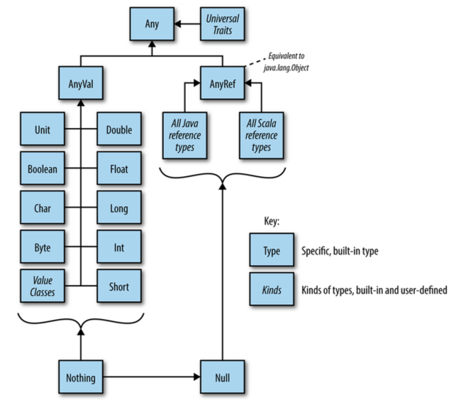

# Object-Oriented Programming

[**刘光聪**](https://github.com/horance-liu)，程序员，敏捷教练，开源软件爱好者，目前供职于中兴通讯无线研究院，具有多年大型遗留系统的重构经验，对面向对象，函数式，大数据等领域具有浓厚的兴趣。

- [github: https://github.com/horance-liu](https://github.com/horance-liu)
- [email: horance@outlook.com](horance@outlook.com)

***

[TOC]

## Referenc Types

- `AnyRef`的子类
- 使用`new`构造对象
- 当存在默认构造函数，可以略去括号
- `AnyRef`等价于`java.lang.Object`
- 可以将`null`赋值给`Reference Type`

***

## Value Types

- `AnyVal`的子类
- `Char, Byte, Short, Int, Long, Float, Double, Unit, Boolean`
- 不能使用`new`构造实例，而使用`Literal Values`构造实例
- 编译器将其映射为`Java`原生类型，以便提升性能
- 不能将`null`赋值给`Int`的变量

```scala
final abstract class Int private extends AnyVal {
  ...
}
```

- `final`表示不能被子类化
- `abstract`表示不能被实例化
- `private`表示主构造函数私有化，进一步保证不能被实例化
- `extends AnyVal`表示只能使用字面值构造实例

***

## 类层次结构



***

## Literal Values

### `Unit` and `()`

`Unit`类型在`JVM`中对应于`Java`的`void`。

```scala
final abstract class Unit private extends AnyVal {
}
```

`()`是其唯一的实例。

```scala
classOf[Unit]   // Class[Unit] = void
().getClass     // Class[Unit] = void

classTag[Unit]  // scala.reflect.ClassTag[Unit] = Unit
classTag[Unit].runtimeClass // Class[_] = void
```

### Procedure

具有返回值类型为`Unit`的函数常常被称为**过程(Procedure)**。

```scala
def update(i: Int, value: Char): Unit = {
  ...
}
```

常常忽略`=`，`Scala`默认推演为`Unit`，上例等价于

```scala
def update(i: Int, value: Char) {
  ...
}
```

### `Null` and `null`

`Null`是所有`AnyRef`的子类型，存在唯一的实例`null`。不能将`null`赋予`Value Types`。

```scala
val num: Int = null  // Error
```

### Symbol Literals

```scala
'1th
'2th
```

如果符号中有空格，可以是使用`Symbol::apply`直接构造

```scala
Symbol("Programming Scala")
```

### Tuple Literal

`(1, "two")`等价于`Tuple2(1, "twp")`，或者`Tuple2[Int, String](1, "two")`。

```scala
val t1 = (1, "two")
val t1: (Int,String) = (1, "two")
val t2: Tuple2[Int,String] = (1, "two")
```

### Function Literals

`(i: Int, s: String) => s+i`是类型为`Function2[Int, String, String]`的一个字面值。

字面值的类型定义常常用于类型声明，如下三个变量定义是相同的：

```scala
val f1: (Int, String) => String = (i, s) => s + i
val f2 = (i: Int, s: String) => s + i
val f3: Function2[Int, String, String] = (i, s) => s+ i
```

### 自定义Literal

#### Map

```scala
val capital = Map("US" -> "Washington", "France" -> "Paris")
```

`"US" -> "Washington"`构造了一个类型为`Tuple2[String, String]`的二元组：`("US", "Washington")`。

```scala
package scala

object Predef {
  implicit final class ArrowAssoc[A](private val self: A) extends AnyVal {
    def ->[B](y: B) = (self, y)
  }
}
```

#### Regex

```scala
val regex = "([0-9]+) ([a-z]+)".r
```

#### String Interpolator

##### 标准的`s, f, raw`

```scala
package scala

case class StringContext(parts: String*) {
  def s(args: Any*): String = ???
  def f(args: Any*): String = ???
  def raw(args: Any*): String = ???
}
```

```scala
s"Hi, $name"
f"$name%s is ${height}%2.2f meters tail"
```
```scala
raw"a\nb"
"""a\nb"""
```

##### 自定义`String Interpolator`

```scala
implicit class JsonHelper(val sc: StringContext) extends AnyVal {
  def json(args: Any*): JSONObject = ???
}

val conf = json"{ a: $a }"
```

***

## Rich类型

```scala
1 to 10
1 until 10
```

`Int`隐式地转换为`RichInt`，从而使调用`to, until`的方法成为可能。其中，`Int`隐式转换为`RichInt`被定义在`Predef`对象中。

```scala
package scala

object Predef {
  implicit def intWrapper(x: Int) = new runtime.RichInt(x)
}
```

## Nothing

`Nothing`是任何类型的子类型，包括`Null`；特殊地，`Scala`推演`throw`语句的返回值类型为`Nothing`。

```scala
package scala

object Predef {
  def ??? = throw new NotImplementedError
}
```

`Nothing`是一个抽象类，在运行时不可能存在`Nothing`的实例，它仅仅为类型推演而存在。

***

## Nil

`Nil`对象定义在`scala.collection.immutable.List`中。

```scala
package scala.collection.immutable

final case class ::[B](private var hd: B, private var tl: List[B]) extends List[B] {
  override def head : B = hd
  override def tail : List[B] = tl
  override def isEmpty: Boolean = false
}

sealed abstract class List[+A] {
  def isEmpty: Boolean
  def head: A
  def tail: List[A]
  
  def ::[B >: A] (x: B): List[B] =
    new scala.collection.immutable.::(x, this)

  def :::[B >: A](prefix: List[B]): List[B] =
    if (isEmpty) prefix
    else if (prefix.isEmpty) this
    else (new ListBuffer[B] ++= prefix).prependToList(this)
}

case object Nil extends List[Nothing] {
  override def isEmpty = true
  override def head: Nothing = throw new NoSuchElementException("empty list")
  override def tail: List[Nothing] = throw new UnsupportedOperationException("empty list")
}
```

被`Predef`隐式地引入

```scala
package object scala {
  val Nil = scala.collection.immutable.Nil
}
```

等价表示可以为：

```scala
List()  // List[Nothing]()
```

`Nil`可以通过`::`方法构造新的`List`

```scala
1 :: 2 :: Nil  // Nil.::(2).::(1), List(1, 2)
```

***

## Optional

***

## 字段

### var

```scala
class Person(var firstName: String, var lastName: String)
```

```java
public class Person {
  private String firstName;
  private String lastName;

  public String firstName();
  public void firstName_$eq(String firstName);

  public String lastName();
  public void lastName_$eq(String lastName);

  public Person(String firstName, String lastName);
}
```

### val

```scala
class Person(val firstName: String, val lastName: String)
```

```java
public class Person {
  private final String firstName;
  private final String lastName;

  public java.lang.String firstName();
  public java.lang.String lastName();

  public Person(String firstName, String lastName);
}
```

### private

```scala
class Person(private val firstName: String, private val lastName: String)
```

```java
public class Person {
  private final String firstName;
  private final String lastName;

  private String firstName();
  private String lastName();

  public Person(String firstName, String lastName);
}
```

### private[this]

```scala
class Person(private[this] var firstName: String, private[this] val lastName: String)
```

```java
public class Person {
  public Person(String firstName, String lastName);
}
```

当且仅当类中的方法使用了构造器参数，才能自动生成字段；否则仅仅作为主构造器使用的普通函数参数。

```scala
class Person(private[this] var firstName: String, private[this] val lastName: String) {
  override def toString = s"Person($firstName, $lastName)"
}
```

```java
public class Person {
  private String firstName;       // var
  private final String lastName;  // val

  public String toString();
  public Person(String firstName, String lastName);
}
```

### 无var/val修饰

工作机制类似于`private[this] val`，当且仅当类中的方法使用了构造器参数，才能自动生成字段；否则仅仅作为主构造器使用的普通函数参数。

```scala
class Person(firstName: String, lastName: String) {
  override def toString = s"Person($firstName, $lastName)"
}
```

```java
public class Person {
  private final String firstName;
  private final String lastName;

  public String toString();
  public Person(String firstName, String lastName);
}
```

### @BeanProperty

```scala
import scala.beans.BeanProperty

class Person(@BeanProperty var firstName: String)
```

```java
public class Person {
  private String firstName;

  public String firstName();
  public void firstName_$eq(String firstName);

  public void setFirstName(String firstName);
  public String getFirstName();

  public Person(String firstName);
}
```

### @BooleanBeanProperty

```scala
import scala.beans.BooleanBeanProperty

class Person(@BooleanBeanProperty val valid: Boolean)
```

```java
public class Person {
  private final boolean valid;

  public boolean valid();
  public boolean isValid();

  public Person(boolean valid);
}
```

***

## 构造函数

### 主/辅构造器

```scala
class Person(private val firstName: String, private val lastName: String) {
  private val age: Int = _

  def this(firstName: String, lastName: String, age: Int) {
    this(firstName, lastName)
	  this.age = age
  }
}
```

- 只有主构造器才能初始化父类；
- 只有主构造函数才能持有构造器参数；
- 辅构造函数的第一行可执行代码要么调用主构造函数，要么调用其它辅构造函数；

### 构造器私有化

```scala
class Person private(private val firstName: String, private val lastName: String)

object Person {
  def apply(firstName: String, lastName: String) = new Person(firstName, lastName)
}
```

```scala
val person = Person("horance", "liu")
```

***

## 方法调用

### `:`结尾的方法

```scala
1 :: 2 :: 3 :: Nil
Nil.::(3).::(2).::(1)
```

```scala
List(1, 2) ::: List(3)
List(3).:::(List(1, 2))
```

### 可选的`.`

为了提高表达力，`obj.do(parameter)`中的`.`常常被省略掉：`obj do parameter`，此时称为中缀表达式。

```scala
0 to arr.length - 1
0.to(arr.length - 1)

0 until arr.length
0.until(arr.length)

0 until (arr.length, 2)
0.until(arr.length, 2)
```

### 无参函数

按照社区惯例，如果没有副作用，则不使用括号；如果存在副作用，则使用括号，加以提示。

```scala
List(1, 2, 3).size     // OK
List(1, 2, 3).size()   // ERROR
```

对于无参数的函数调用，并括号可以省略的，常常被称为后缀表达式。

```scala
import scala.language.postfixOps

1 toString
List(1, 2, 3) size
```

### 具名参数

```scala
trait ProductSpec {
  def satisfy(p: Product): Boolean
}

sealed class CombinableSpec(shortcut: Boolean, specs: ProductSpec*) extends ProductSpec {
  override def satisfy(p: Product): Boolean = {
    specs.exists(_.satisfy(p) == shortcut)
  }
} 

case class AndSpec(preds: ProductSpec*) extends CombinableSpec(shortcut = false, preds: _*)
case class OrSpec(preds: ProductSpec*) extends CombinableSpec(shortcut = true,  preds: _*)
```

### `by name`参数

`by name`参数具有如下几个特点：

- 延迟计算
- 行为类似于无参函数

#### Scala ARM

```scala
import scala.language.reflectiveCalls
import scala.util.control.NonFatal

object manage {
  def apply[R <: {def close(): Unit}, T](resource: => R)(f: R => T) = {
    var res: Option[R] = None
    try {
      res = Some(resource)
      f(res.get)
    } catch {
      case NonFatal(ex) => println(s"Non fatal exception: $ex")
    } finally {
      for (s <- res) {
        s.close()
      }
    }
  }
}
```

```scala
object ScalaARM {
  def main(args: Array[String]) {
    args.map(lines).foreach(println)
  }

  import scala.io.Source

  private def lines(file: String) = {
    manage(Source fromFile file) { _.getLines.size }
  }
}
```

`Source.fromFile(file)`至到`res = Some(resource)`时才被计算，并且每出现一次，则计算一次，其行为类似于函数调用。

##### 无参函数的实现

但如果使用无参函数的设计手法，则语法就没那么简洁和漂亮。

```scala
import scala.language.reflectiveCalls
import scala.util.control.NonFatal

object manage {
  def apply[R <: {def close(): Unit}, T](resource: () => R)(f: R => T) = {
    var res: Option[R] = None
    try {
      res = Some(resource())  // invoke function
      f(res.get)
    } catch {
      case NonFatal(ex) => println(s"Non fatal exception: $ex")
    } finally {
      for (s <- res) {
        s.close()
      }
    }
  }
}
```

```scala
object ScalaARM {
  def main(args: Array[String]) {
    args.map.(lines).foreach(println)
  }

  import scala.io.Source

  private def lines(name: String) = {
    manage(() => Source.fromFile(name)) { _.getLines.size }
  }
}
```

#### `loop`模拟

```scala
@annotation.tailrec
def loop(cond: => Boolean)(body: => Unit) {
  if (cond) {
    body
	  loop(cond)(body)
  }
}
```

```scala
var i = 0
loop (i < 10) {
  println(i)
  i += 1
}
```

***

## 伴生对象

```scala
package scala

final class Array[T](size: Int) {
  def length: Int
  def apply(i: Int): T
  def update(i: Int, x: T)
}

object Array {
  def apply[T](xs: T*): Array[T]
}
```

***

## `apply` and `update`

```scala
val numbers = Array(1, 2, 3)           // val numbers = Array.apply(1, 2, 3)
numbers(1)                             // numbers.apply(1)
numbers(1) = 100                       // numbers.update(1, 100)
```

注意区分如下两个语句的不同：

```scala
Array(3)      // res0: Array[Int] = Array(3)
new Array(3)  // res1: Array[Nothing] = Array(null, null, null)
```

***

## 信息隐藏

### 包可见性

使用`private['package']`的修饰符，实现仅对`package`可见，类似于`Java`中的默认的`package`可见性。`LowPriorityImplicits`仅仅供包`scala`内部使用，而不公开。

```scala
package scala

object Predef extends LowPriorityImplicits {
}

private[scala] abstract class LowPriorityImplicits {
  @inline implicit def intWrapper(x: Int) = new runtime.RichInt(x)
}
```

也可以修饰类成员，可被同一包下的其他实体可见。

```scala
package com.acme.store

class Foo {
  private[store] def description = "I'm com.acme.store.Foo"
}

class Bar {
  def describe(foo: Foo) = foo.description
}
```

### `protected`仅对子类有效

```scala
package automobiles

class Vehicle {
  protected def checkEngine() {}
}

class Car extends Vehicle {
  def start() { checkEngine() /* OK */}
  def tow(car: Car) { car.checkEngine() /* OK */}
  def tow(vehicle: Vehicle) { vehicle.checkEngine() /* Error */}
}

class GasStation {
  def fillGas(vehicle: Vehicle) {
    vehicle.checkEngine  /* Error */
  }
}
```

### `private[this]`对象私有性

```scala
class Executive {
  private[this] var secrets: String = _

  def help(another: Executive) {
    another.secrets  // Error
  }
}
```

### `protected[this]`子对象私有性

```scala
package automobiles

class Vehicle {
  protected[this] def checkEngine() {}
}

class Car extends Vehicle {
  def tow() { checkEngine() /* OK */}
  def tow(car: Car) { car.checkEngine() /* Error */ }
}
```

***

## 重写`override`

使用`override val`重写抽象的`val`字段。

```scala
abstract class Foo { val id: Int }
class Bar(override val id: Int) extends Foo
```

也尝尝使用`override val`重写抽象的`def`无参方法。

```scala
abstract class Foo{ def id: Int }
class Bar(override val id: Int) extends Foo
```

可以使用`override var`重写`getter/setter`对

```scala
abstract class Foo {
  def identity: Int
  def identity_=(id: Int)
}

class Bar(override var identity: Int) extends Foo
```

或者使用`override var`重写抽象的`var`字段。

```scala
abstract class Foo {
  var identity: Int
}

class Bar(override var identity: Int) extends Foo
```

`override def`用于重写父类中的非`private`的方法。

```scala
class Foo {
  override def toString = "Foo"
}
```

`private`隐式地隐含`final`的语义，不能被`override`，与`Java`的语义相同。

```scala
class Foo{ private def id: Int = 0 }
class Bar(override val id: Int) extends Foo  // error: value id overrides nothing
```

***

## Case Class

`Case Class`是一种特殊的类，常常用于模式匹配。

```scala
case class Dollar(amount: Int)
```

- 字段自动成为`val`，除非显式地提供了`var`定义
- 自动生成`toString, equals, hashCode, copy`方法
- 自动地生成伴生对象的`apply/unapply`方法

```scala
class Dollar(val amount: Int) {
  def toString: String = ...
  def equals(other: Any): Boolean = ...
  def hashCode(): Int = ...
}

object Dollar {
  def apply(amount: Int) = new Dollar(amount)
  def unapply(d: Dollar): Option[Int] = Some(d.amount)
}
```

***

## 继承

***

## 特质

### Rich Interface

```scala
trait RichIterable[A] {
  def iterator: Iterator[A]

  def foreach(f: A => Unit) = {
    val iter = iterator
	  while (iter.hasNext) f(iter.next)
  }

  def foldLeft[B](seed: B)(f: (B, A) => B) = {
    var result = seed
	  foreach(e => result = f(result, e))
	  result
  }
}
```

### Stacked Modification

#### `IgnoreCaseSet`

```scala
trait IgnoreCaseSet extends java.util.Set[String] {
  abstract override def add(e: String) = {
    super.add(e.toLowerCase)
  }

  abstract override def contains(e: String) = {
    super.contains(e.toLowerCase)
  }

  abstract override def remove(e: String) = {
    super.remove(e.toLowerCase)
  }
}
```

```scala
val set = new java.util.HashSet[String] with IgnoreCaseSet

set.add("HORANCE")
set.contains("horance")  // TRUE
```

#### `LoggableSet`

```scala
trait LoggableSet extends java.util.Set[String] {
  abstract override def add(e: String) = {
    println("Add: " + e)
	  super.add(e)
  }

  abstract override def remove(e: String) = {
    println("Remove: " + e)
	  super.remove(e)
  }
}
```

#### Order is Important

```scala
val set = new java.util.HashSet[String]
          with LoggableSet
		      with IgnoreCaseSet

set.add("HORANCE")  // Add: horance
```

```scala
val set = new java.util.HashSet[String]
          with IgnoreCaseSet
		      with LoggableSet

set.add("HORANCE")  // Add: HORANCE
```

### Composition

```scala
val order = new Order(customer)
   with Entity
   with InventoryItemSet
   with Invoicable
   with PurchaseLimiter
   with MailNotifier
   with ACL
   with Versioned
   with Transactional
```

***

## 相等性

***

